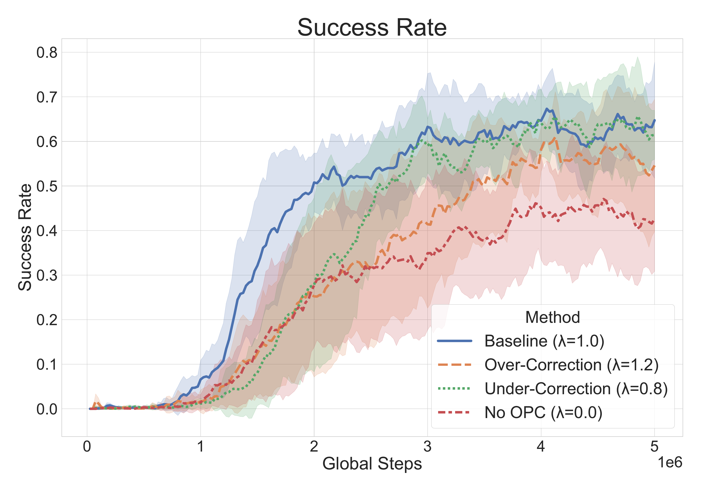
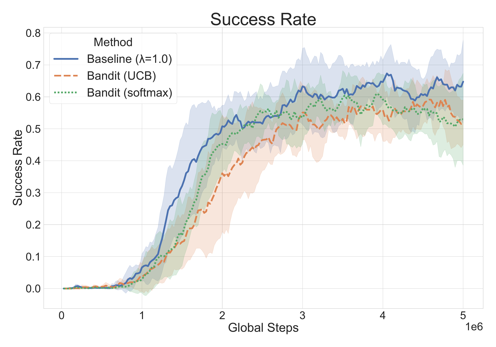
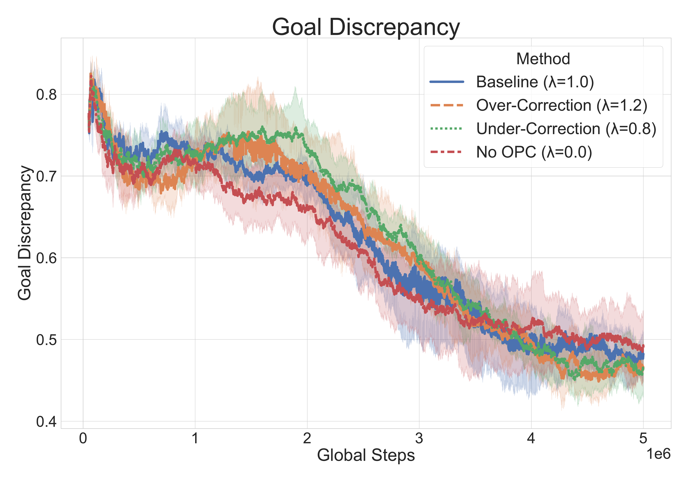
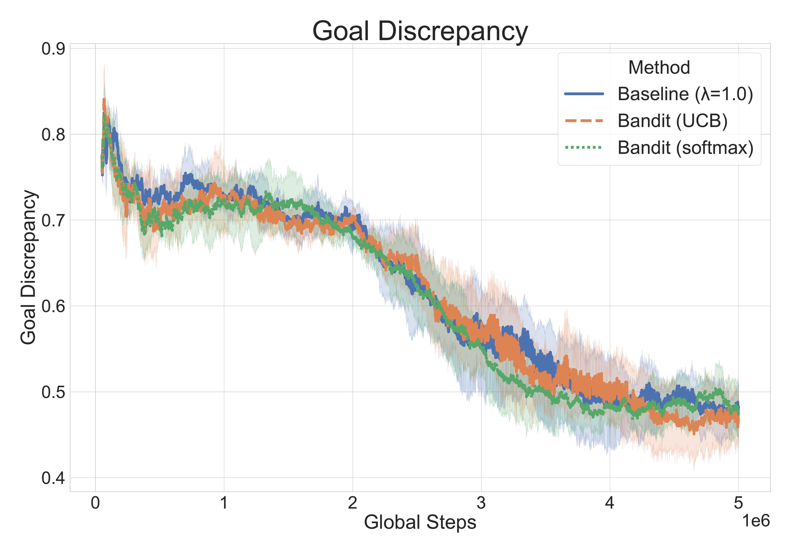
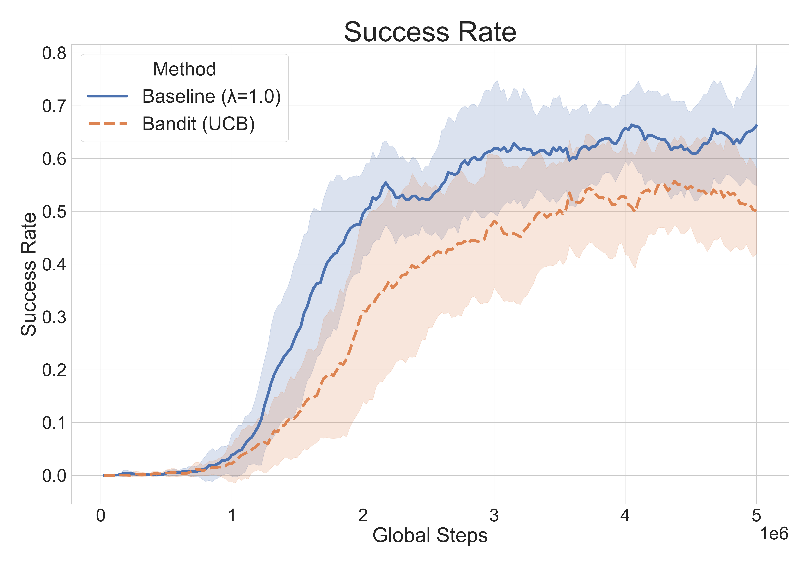
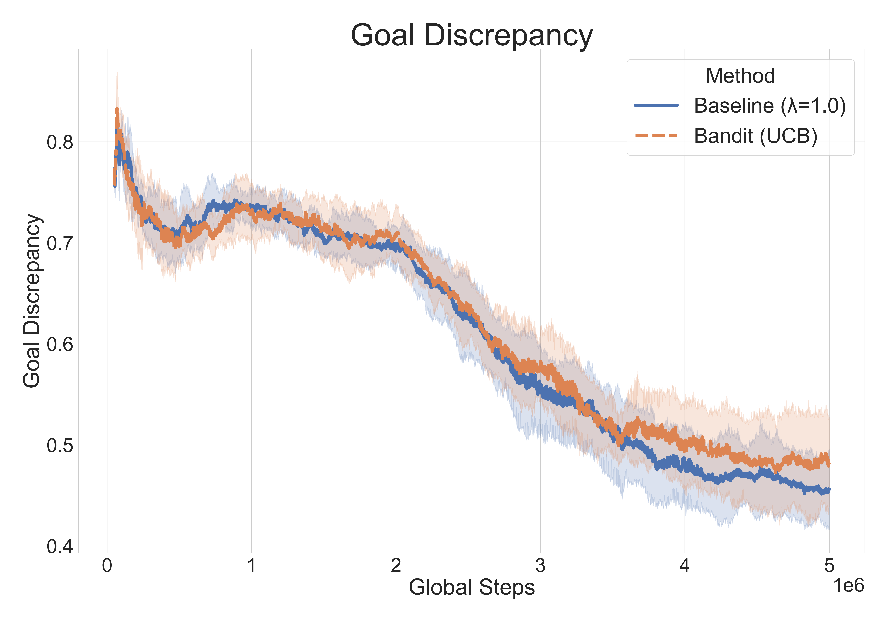
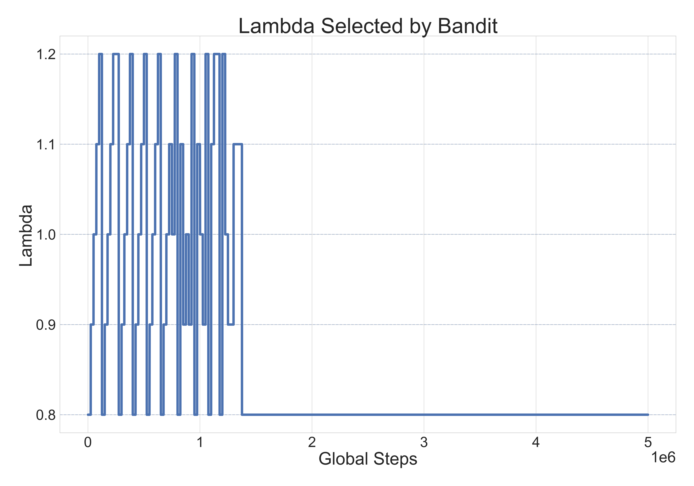
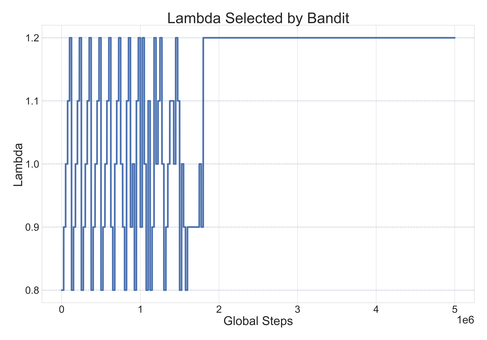

# Temporal Analysis and Adaptive Scheduling of Off-Policy Correction in HIRO

## Introduction

Hierarchical Reinforcement Learning (HRL) addresses long-horizon decision-making by decomposing control into multiple temporal levels. Instead of selecting primitive actions at every step, an agent can reason over extended time scales by delegating execution to a lower-level controller. This structure is particularly effective in sparse-reward environments, where temporal abstraction and improved exploration are critical.

In HRL, a high-level policy proposes subgoals, while a low-level policy executes primitive actions to reach those subgoals. By separating planning and execution, HRL enables more efficient learning in tasks that require long sequences of coordinated actions.

## HIRO and Off-Policy Correction

HIRO (Hierarchical Reinforcement Learning with Off-Policy Correction), proposed by Nachum et al., uses raw state differences as high-level goals. The low-level policy is trained using an intrinsic reward that encourages matching the instructed goal. This design allows the lower-level policy to learn goal-conditioned behaviors without manually defined subgoals or representations.

To enable off-policy training at the high level, HIRO applies off-policy correction. Past high-level transitions are relabeled by replacing the original goal $g$ with a corrected goal $g'$, where $g'$ maximizes the likelihood of the observed low-level actions under the current low-level policy. This correction mitigates non-stationarity between the two levels and allows reuse of replayed experience.

More concretely, HIRO selects the corrected goal

$$
g' = \arg\max_g \sum_{i=t}^{t+c-1} - \| a_i - \mu^{\text{lo}}(s_i, g_i) \|_2^2 .
$$

Intermediate goals follow the deterministic transition $g_{i+1} = h(s_i, g_i)$. In practice, HIRO evaluates a small set of candidate goals sampled near $s_{t+c} - s_t$ and selects the one with minimal action prediction error. The relabeled transition $(s_t, g')$ is then used for off-policy high-level TD updates.

## Problem Statement

Although off-policy correction is essential in HIRO, it is always applied with full, fixed strength. This implicitly assumes that relabeled goals are uniformly beneficial throughout training. However, as the low-level policy evolves, the mismatch between the original goal and the corrected goal may vary over time, suggesting that a fixed correction strategy may not always be optimal.

Several prior works propose alternative relabeling mechanisms, such as inverse-model-based correction (Kim et al.) or soft relabeling (Wang et al.), but these approaches introduce significant computational overhead. This raises a natural question: can we improve performance by adjusting the strength of off-policy correction, without introducing heavy additional computation?

## Main Idea

We reinterpret HIRO's off-policy correction as a tunable operation rather than a binary choice. Instead of fully replacing the original goal, we define a mixed goal

$$
g_{\text{new}} = \lambda g' + (1 - \lambda) g ,
$$

where $\lambda$ controls the correction strength. Original HIRO corresponds to $\lambda = 1$.

This formulation allows us to test fixed values of $\lambda$ as simple baselines and to explore adaptive strategies where $\lambda$ varies over training. Our hypothesis is that the usefulness of off-policy correction may change as learning progresses, and that non-constant $\lambda$ could potentially stabilize training or improve final performance.

## Method

### Approach

We evaluate the following variants under identical training conditions:
- Fixed correction strengths with $\lambda \in \lbrace0.0, 0.8, 1.0, 1.2
brace$.
- Adaptive scheduling using bandit-based selection (UCB and softmax) over candidate values $\lbrace0.8, 0.9, 1.0, 1.1, 1.2
brace$, where the feedback signal is the evaluation success rate over a fixed interval.

In addition to performance, we analyze the temporal behavior of the goal discrepancy

$$
\Delta g = \| g - g' \|_2 ,
$$

to examine whether it provides useful signals for adaptive correction. The goal is to determine whether any $\lambda \neq 1$ or time-varying $\lambda(t)$ yields consistent benefits.

### Experimental Setup

- Environment: `AntMaze_UMaze-v5`.
- Metric: success rate over training.
- High-level correction applied every 10 steps.
- Training horizon: 5 million environment steps.
- All methods evaluated using the same random seeds.

## Results

### Effect of $\lambda$ on Performance

We empirically test whether treating off-policy correction as a tunable strength improves performance. The figure below compares fixed $\lambda$ values and bandit-based adaptive methods in terms of success rate over training.

  
  

### Goal Discrepancy Analysis

We also analyze the goal discrepancy $\Delta g = \| g - g' \|_2$ over training. The figure below shows that while different correction strategies induce distinct temporal patterns in $\Delta g$, these differences do not clearly correlate with improved task performance.

  
  

### Success Rate Comparison

The table below reports the final average success rate at 5M training steps, along with the standard deviation, averaged over 5 seeds.

| Method                             | Success Rate             |
| ---------------------------------- | ------------------------ |
| Baseline ($\lambda = 1.0$)         | $\mathbf{0.71 \pm 0.23}$ |
| Under-correction ($\lambda = 0.8$) | $0.62 \pm 0.08$          |
| Over-correction ($\lambda = 1.2$)  | $0.59 \pm 0.15$          |
| No OPC ($\lambda = 0.0$)           | $0.47 \pm 0.13$          |
| Bandit (UCB)                       | $0.54 \pm 0.10$          |
| Bandit (Softmax)                   | $0.53 \pm 0.19$          |

### Additional Check

We additionally compare the baseline and bandit-based methods using 10 seeds to reduce variance. As shown in the figure below, the bandit methods consistently underperform the baseline in terms of success rate.

  
  

### Bandit Behavior Analysis

To better understand bandit-based scheduling, we visualize the $\lambda$ values selected over training for two seeds.

  
  

## Discussion

Across all evaluated settings, full off-policy correction consistently matches or outperforms alternative strategies. Although adaptive methods and partial correction modify the goal discrepancy dynamics, these variations do not translate into improved success rates. This suggests that $\Delta g$ alone does not provide a reliable signal for scheduling correction strength. Meanwhile, during training, the bandit explores multiple $\lambda$ values in early stages and converges to a single value within each run, but the converged value is inconsistent across runs.

Overall, the stability of $\lambda = 1$ indicates that HIRO's original off-policy correction is already sufficient for this environment.

## Limitations and Future Work

Our analysis is limited to `AntMaze_UMaze`, and more complex environments may benefit from adaptive correction strategies. Additionally, more expressive designs, such as continuously updating $\lambda$, could provide finer control and remain an interesting direction for future work.

## Conclusion

We studied whether adjusting the strength of off-policy correction in HIRO improves performance. Across fixed and adaptive variants, we find that $\lambda = 1$ remains a robust choice. These results suggest that always applying full off-policy correction is a reasonable and effective strategy in this setting.

## References

- Nachum et al., *Data-Efficient Hierarchical Reinforcement Learning*, NeurIPS 2018
- Kim et al., *Hierarchical Reinforcement Learning with Optimal Level Synchronization based on a Deep Generative Model*, IEEE TNNLS 2021
- Wang et al., *Guided Cooperation in Hierarchical Reinforcement Learning via Model-based Rollout*, NeurIPS 2023
